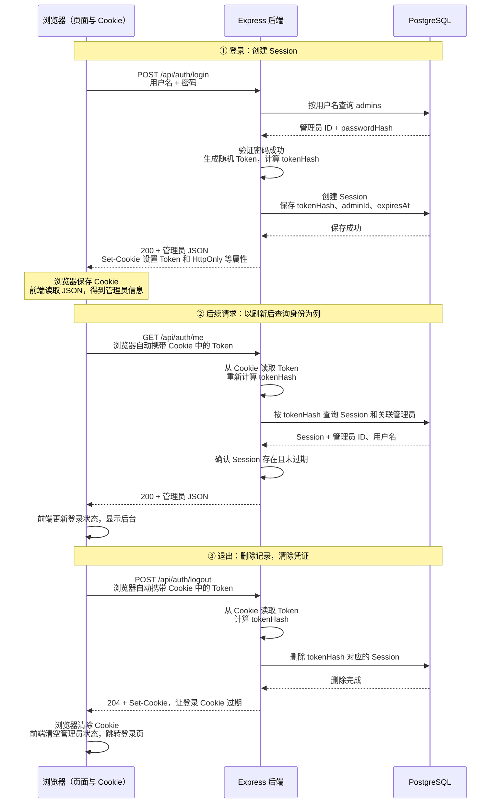

# 17. 登录和安全：服务器怎样确认管理员身份

> Mini CMS 阶段 6。先看懂本章流程，再按第 17A 章实现。

管理员登录后，服务器怎样认出下一次请求？本项目用**数据库 Session + HttpOnly Cookie**：数据库保存登录记录，浏览器保存并携带对应凭证。

从上到下看图中的登录、后续请求和退出。三列分别是浏览器、Express 后端和 PostgreSQL；箭头标出传递的数据，后端通过 Prisma 操作数据库。



图中画的是成功流程。第二段用 `/me` 查询身份举例；文章、标签管理接口也会先验证凭证，通过后才继续读写业务数据。

## 1. 登录：浏览器和数据库分别保存什么

对应图中 **① 登录**。管理员账号已由第 17A 章的初始化脚本创建，登录接口负责验证这个已有账号。

**Session 是数据库中记录一次登录的那条数据。** 它包含 `tokenHash`、`adminId` 和 `expiresAt`，分别用来查找凭证、关联管理员和判断过期时间。一个管理员在不同设备登录，可以有多条 Session。

先区分图里的四份数据：

| 数据 | 保存或返回到哪里 | 用来做什么 |
|---|---|---|
| `passwordHash` | 数据库的 `admins` 表 | 登录时验证用户输入的密码 |
| Token | 浏览器的 Cookie | 作为后续请求的登录凭证 |
| `tokenHash` | 数据库的 `sessions` 表 | 根据收到的 Token 查找登录记录 |
| 管理员 JSON | 返回给前端，放入页面状态 | 显示当前管理员 ID、用户名 |

**Token 是服务器生成的随机字符串**，本身不包含管理员身份。**哈希是由原始数据按算法计算出的摘要**，这里用它验证密码或查询凭证，不从摘要还原原文。

数据库保存 Token 的哈希，可以避免泄露的 `tokenHash` 被直接拿来当登录凭证。`passwordHash` 和 `tokenHash` 处理的对象不同，两者的具体生成方法在 17A 中分别实现。

**Cookie 是浏览器保存和携带数据的机制。** 登录响应里，`Set-Cookie` 响应头交给浏览器保存凭证，JSON 交给前端显示信息。下面只示意响应头，`example-token` 在实操中会换成随机 Token：

```http
Set-Cookie: mini_cms_session=example-token; Path=/; HttpOnly; SameSite=Lax
```

**HttpOnly 表示前端 JavaScript 不能直接读取这条 Cookie。** 浏览器仍然能保存和发送它，因此前端不用读取 Token，也不用把它存进 `localStorage`。

## 2. 后续请求：服务器怎样认出管理员

对应图中 **② 后续请求**。浏览器按 Cookie 的规则和请求配置，自动把凭证放进请求头：

```http
Cookie: mini_cms_session=example-token
```

前一节的 `Set-Cookie` 是服务器让浏览器保存数据；这里的 `Cookie` 是浏览器把数据带回服务器。前端的 `fetch()` 不需要手动拼接这个请求头。

服务器收到 Token 后，重新计算哈希，用得到的 `tokenHash` 查询 Session。**同一个 Token 按相同方法计算，会得到相同的哈希**，因此能找到登录时保存的记录。

这段检查放在 Express 的 `requireAuth` 认证中间件里。它确认 Cookie 中有 Token、数据库里有对应 Session，并且 Session 未过期，才把管理员身份交给后续路由；没有有效凭证就返回 **401**。

刷新页面后，React 的管理员状态重新初始化，但浏览器仍可保留未过期的 Cookie。前端调用 `/me`，后端查出身份并返回管理员 JSON，页面就能恢复显示。这次请求没有再次提交密码，也没有创建新的 Session。

前端检查登录状态，未登录时跳转登录页，验证成功后才显示后台；后端在每次管理接口请求中继续验证凭证。即使用 Apifox 直接请求文章、标签接口，也必须通过认证。

## 3. 退出：为什么既删 Session，又清 Cookie

对应图中 **③ 退出**。两个动作分别影响服务器和浏览器：

- **删除 Session**：服务器不再认可这份凭证。即使旧 Token 再次被发送，也查不到有效记录。
- **清除 Cookie**：服务器用 `Set-Cookie` 让登录 Cookie 过期，浏览器删除保存的 Token。

如果只清除浏览器 Cookie，数据库中的登录记录仍然存在，其他地方保存的旧 Token 可能继续有效。因此退出接口要先删除当前 Session，再清除 Cookie。

退出成功返回 **204**，表示请求已完成、没有响应体。前端随后清空管理员状态并跳转登录页。

## 4. 图中的 Cookie 往返需要哪些配置

开发环境中，前端是 `http://localhost:3000`，后端是 `http://localhost:3001`。来源由协议、主机和端口组成，这两个地址端口不同，属于跨来源请求。

图中的 Cookie 自动保存和携带，需要下面这些配置配合。这里先理解作用，具体代码统一放到第 17A 章：

| 配置 | 影响图里的哪一步 |
|---|---|
| 前端 `credentials: "include"` | 跨来源登录时接收 Cookie，后续请求携带 Cookie；登录请求也要设置 |
| 后端 CORS 配置准确的 `origin` 和 `credentials: true` | 允许指定前端读取带凭证的跨来源响应 |
| Cookie 的 `SameSite=Lax` | 限制跨站请求何时自动携带 Cookie |
| 后端检查写请求的 `Origin` | 拒绝来自未配置来源的写请求，降低跨站请求伪造（CSRF）风险 |
| Cookie 的 `Secure` | 生产环境只通过 HTTPS 发送 Cookie |

CSRF 是其他网站诱导浏览器携带现有凭证发出请求。这些配置负责约束浏览器怎样使用凭证，`requireAuth` 仍负责检查凭证是否有效。

上面的两个 localhost 地址虽然跨来源，但仍属于同站，`SameSite=Lax` 不会仅因端口不同就阻止 Cookie。跟练时前后端统一使用 `localhost`，具体设置见 17A。

## 5. 接触过 JWT，怎样对应到这张图

主要变化在图中后端验证凭证的方式：

| 操作 | 常见的无状态 JWT 方案 | 本项目的数据库 Session |
|---|---|---|
| 登录成功 | 签发包含身份信息、过期时间等内容的 JWT | 生成随机 Token，保存登录记录 |
| 后续认证 | 验证签名、过期时间等条件 | 用 Token 哈希查记录，检查过期时间 |
| 提前撤销 | 需要额外的撤销机制 | 删除对应记录 |

JWT 也可以放进 HttpOnly Cookie。你之前学过的密码验证、认证中间件和 401 处理，仍然适用。

Mini CMS 已有 PostgreSQL 和 Prisma，数据库 Session 能复用已学过的创建、查询和删除，也方便撤销登录。代价是每次认证增加数据库查询，这是当前单管理员后台可以接受的取舍。

现在回看图，确认能解释：登录后两边分别保存什么、下一次请求怎样找到管理员、退出后旧凭证为什么失效。然后进入 [17A-管理员登录实操](./17A-管理员登录实操-用Session和Cookie保护写接口.md)，沿着同一条流程完成代码。

## 官方参考

- [MDN：Set-Cookie 与 HttpOnly](https://developer.mozilla.org/en-US/docs/Web/HTTP/Reference/Headers/Set-Cookie)
- [OWASP：Session 管理](https://cheatsheetseries.owasp.org/cheatsheets/Session_Management_Cheat_Sheet.html)
- [Auth.js：JWT 与数据库 Session 的取舍](https://authjs.dev/concepts/session-strategies)
